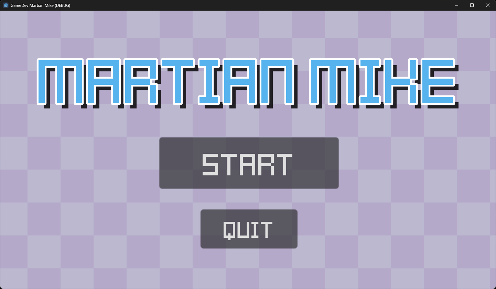
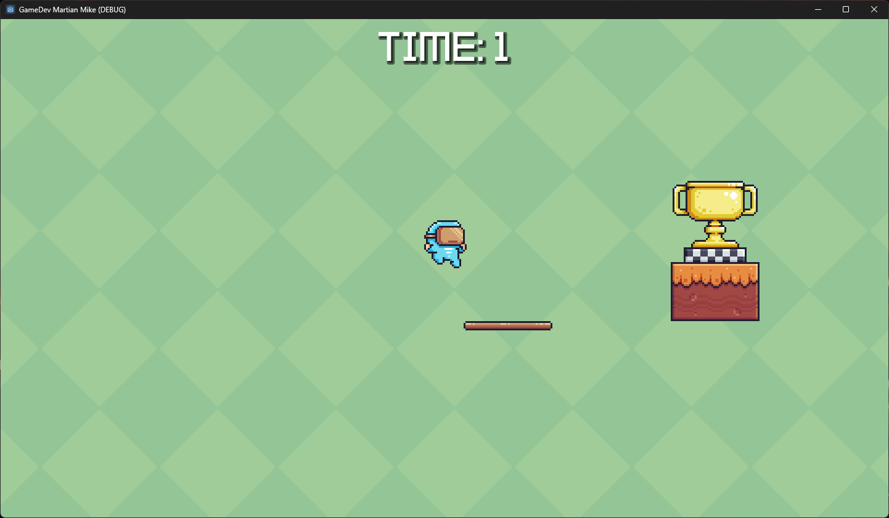
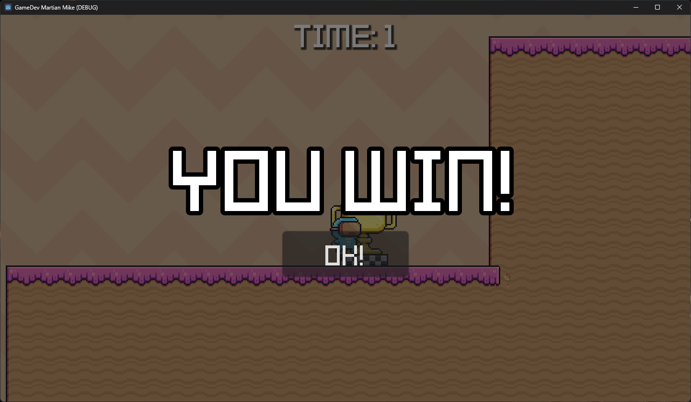

<a id="readme-top"></a>

<!-- TITLE -->
# Alien Attack

<!-- SCREENSHOTS -->
  

<!-- DESCRIPTION -->
A 2D platformer game built with Godot 4. Move (LEFT/RIGHT/SPACE) to reach the finish area, avoiding traps, and before time runs out. Features animated sprites, parallax backgrounds, multiple levels, background music and sound effects. Part of [GameDev.TV](https://gamedev.tv)'s course, [Complete Godot 4 2D](https://www.gamedev.tv/courses/godot-complete-2d).

<!-- PROJECT SHIELDS -->
[](https://godotengine.org/)

<p align="right">(<a href="#readme-top">back to top</a>)</p>

<!-- GETTING STARTED -->
## Getting Started

To build the game on your own machine:
1. Get Godot Engine for free at [GodotEngine.org](https://godotengine.org/)
2. Clone the repo
   ```sh
   git clone https://github.com/github_username/repo_name.git
   ```
3. Open the `project.godot`
4. To preview the game, click the `Run Project` button, or hit the `F5` key.
5. To build the game, click `Project` and then `Export...`, and choose your target device. 

<p align="right">(<a href="#readme-top">back to top</a>)</p>

<!-- ACKNOWLEDGMENTS -->
## Acknowledgments

* [Sprite & Map graphics by Pixel Frog](https://pixelfrog-assets.itch.io/pixel-adventure-1)
* [Kenney Blocks font by Kenney](https://kenney.nl/assets/kenney-fonts)

<p align="right">(<a href="#readme-top">back to top</a>)</p>
